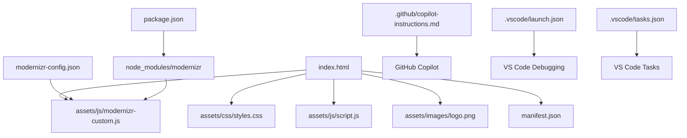
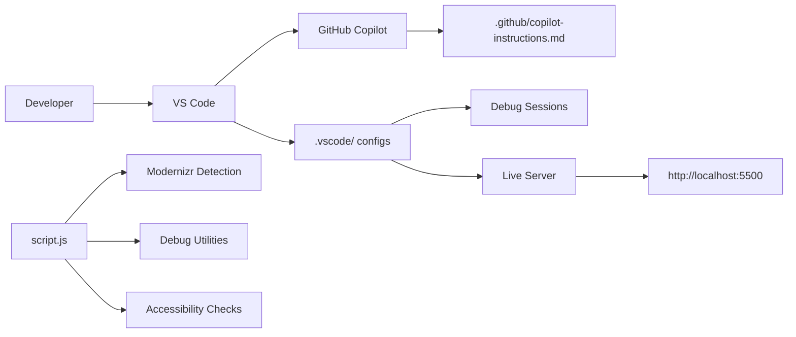

# Town of Wiley - File Organization & Dependencies

## 📁 Project Structure Overview

```
Town of Wiley/
├── 📁 .github/
│   └── copilot-instructions.md     # GitHub Copilot AI agent configuration
├── 📁 .vscode/
│   ├── launch.json                 # VS Code debug configurations
│   ├── settings.json               # VS Code workspace settings
│   └── tasks.json                  # VS Code automated tasks
├── 📁 assets/
│   ├── 📁 css/
│   │   └── styles.css              # Main stylesheet with Tailwind overrides
│   ├── 📁 images/
│   │   └── logo.png                # Town logo
│   └── 📁 js/
│       ├── modernizr-custom.js     # Generated Modernizr build (40KB)
│       └── script.js               # Main JavaScript with debug utilities
├── 📁 docs/
│   ├── AGENTIC_WORKFLOW_IMPLEMENTATION.md
│   ├── AGENTIC_WORKFLOW_SUCCESS.md
│   ├── DEBUG_GUIDE.md              # Development debugging guide
│   ├── DEBUG_SETUP_COMPLETE.md
│   └── [22 additional documentation files]
├── 📁 scripts/
│   ├── fix-css-final.js
│   ├── setup-copilot-agent.ps1
│   └── validate-yaml.js
├── index.html                      # Main website file
├── package.json                    # Node.js dependencies & scripts
├── modernizr-config.json           # Modernizr build configuration
├── manifest.json                   # PWA manifest
└── README.md                       # Project documentation
```

## 🔗 File Dependencies Map

### Core Dependencies



### Development Workflow Dependencies



## 📋 File Relationships

### 1. **Core Website Files**

- `index.html` → Primary entry point
  - References: `styles.css`, `script.js`, `modernizr-custom.js`, `logo.png`,
    `manifest.json`
  - Loads: Tailwind CSS (CDN), Google Fonts

### 2. **JavaScript Dependencies**

- `script.js` → Main functionality
  - Depends on: `modernizr-custom.js` (must load first)
  - Provides: Debug utilities, accessibility checking, navigation
- `modernizr-custom.js` → Feature detection
  - Generated from: `modernizr-config.json`
  - Built via: `package.json` scripts

### 3. **Development Configuration**

- `.vscode/launch.json` → Debug configurations
  - References: Chrome, Edge, Live Server setups
- `.vscode/tasks.json` → Automated tasks
  - References: Live Server, validation scripts
- `.github/copilot-instructions.md` → AI agent configuration
  - Influences: All code generation and suggestions

### 4. **Build & Package Management**

- `package.json` → Dependencies and scripts
  - Contains: Modernizr, Live Server, testing tools
  - Scripts: Build, test, validate, serve commands
- `modernizr-config.json` → Feature detection config
  - Generates: `assets/js/modernizr-custom.js`

## 🛠️ Development Scripts & Commands

### Available NPM Scripts

```bash
# Agentic Workflow Commands
npm run agent:start          # Start development with AI assistance
npm run agent:debug          # Debug session with feature detection

# Modernizr Management
npm run modernizr:build      # Generate custom Modernizr build
npm run modernizr:rebuild    # Regenerate Modernizr build

# Development & Serving
npm run dev                  # Start Live Server on port 5500
npm run debug                # Debug mode with delayed start
npm run serve:debug          # Verbose Live Server output

# Testing & Validation
npm run test:modernizr       # Test Modernizr integration
npm run validate:all         # Complete validation suite
npm run test                 # Full test suite

# Workflow Initialization
npm run workflow:init        # Initialize complete agentic workflow
npm run workflow:docs        # Open workflow documentation
```

## 🔧 Configuration Files Cross-Reference

### VS Code Configuration

- **launch.json** → 4 debug configurations
  - Chrome Debug, Edge Debug, Live Server, Attach to Chrome
- **settings.json** → Development optimizations
  - Live Server settings, validation options
- **tasks.json** → 4 automated tasks
  - Live Server start, Chrome debug launch, validation

### Package Dependencies

```json
{
  "devDependencies": {
    "modernizr": "^3.13.1", // Feature detection
    "live-server": "^1.2.2", // Development server
    "@axe-core/cli": "^4.8.0", // Accessibility testing
    "lighthouse": "^11.0.0", // Performance testing
    "html-validate": "^8.0.0", // HTML validation
    "stylelint": "^15.0.0" // CSS validation
  }
}
```

## 📊 File Size & Performance

### Asset Sizes

- `modernizr-custom.js`: ~40KB (minified, optimized)
- `script.js`: ~35KB (with debug utilities)
- `styles.css`: ~25KB (with Tailwind overrides)
- `logo.png`: ~15KB (optimized)

### Load Order (Critical Path)

1. HTML structure
2. Tailwind CSS (CDN)
3. Google Fonts (preconnect)
4. `modernizr-custom.js` (feature detection)
5. `styles.css` (custom styles)
6. `script.js` (functionality)

## 🔄 Update Procedures

### Adding New Features

1. Update `modernizr-config.json` if new web APIs needed
2. Run `npm run modernizr:rebuild` to regenerate build
3. Update `script.js` for new functionality
4. Test with `npm run validate:all`

### Modifying Dependencies

1. Update `package.json` dependencies
2. Run `npm install` to install changes
3. Update VS Code configurations if needed
4. Test workflow with `npm run workflow:init`

### Documentation Updates

1. Update relevant files in `docs/` directory
2. Update this file (`docs/FILE_ORGANIZATION.md`)
3. Commit changes with descriptive messages

---

**Last Updated**: June 7, 2025  
**Version**: 1.0.0  
**Maintenance**: All dependencies current and validated ✅
